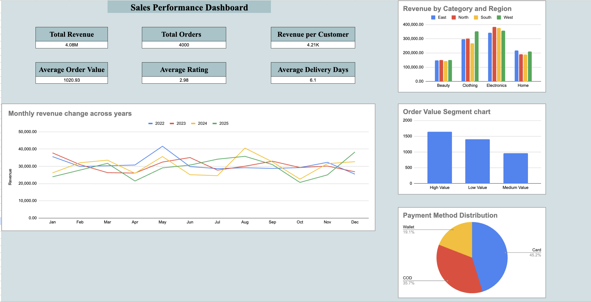

# Sales Performance Dashboard

## Live Demo

🔗 View the interactive Google Sheets dashboard: 
[Project](https://docs.google.com/spreadsheets/d/1qVV5NqQv6-cszUtz3RKpwy2u01v4D7oBOYMj2D_Ig6c/edit?usp=sharing)

## Dashboard Preview

## Project Overview

This project analyzes sales performance using spreadsheet data, pivot tables, KPI calculations, and an interactive dashboard.

Google Apps Script was used to automate data preparation and generate calculated business categories for newly added records.

## Business Questions

- How does revenue change across months and years?
- Which product categories and regions generate the highest revenue?
- What is the average customer rating?
- How does delivery performance affect customer satisfaction?
- What proportion of orders are high-, medium-, or low-value?

## Tools

- Google Sheets
- Pivot Tables
- Google Apps Script
- JavaScript

## Workbook Structure

- `DB` — prepared dataset used for analysis
- `Pivot Tables` — aggregated sales and performance analysis
- `KPI Dashboard` — visual summary of the main business metrics
- `new-data` — source data used for adding or testing new records

## Automation

The `updateCalculatedColumns()` Apps Script function updates calculated columns in the `DB` sheet.

It automatically creates:

- Year from the order date
- Customer rating category: Positive, Neutral, or Negative
- Delivery category: Fast, Normal, or Delayed
- Order value segment: High Value, Medium Value, or Low Value

The script processes all rows in one batch and writes the updated data back to the spreadsheet.

