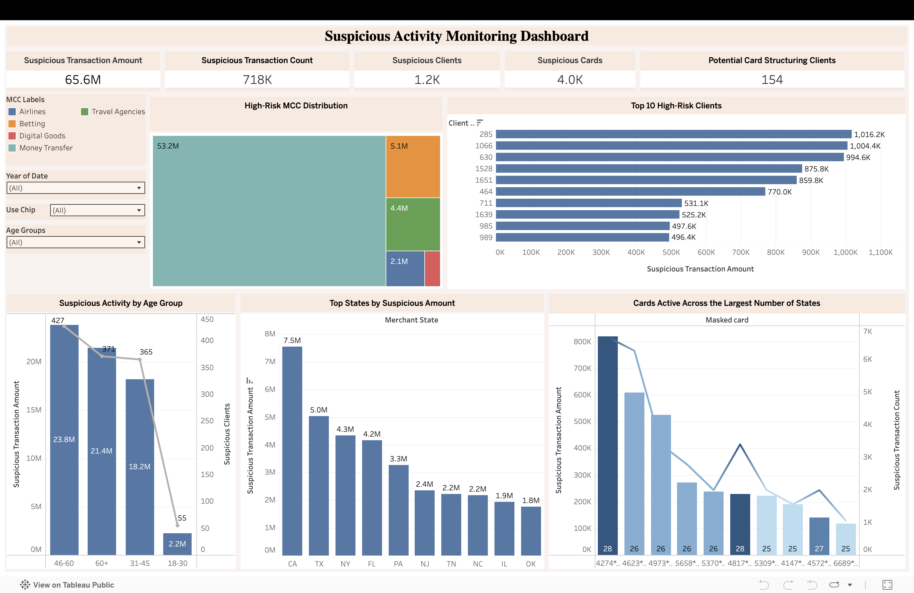

# Suspicious Activity Monitoring Dashboard

## Overview

This project uses SQL and Tableau to analyze transaction data and identify patterns that may indicate suspicious or potentially fraudulent activity. The analysis focuses on high-risk merchant categories, unusual customer behavior, geographic transaction patterns, and cards with activity spread across multiple locations.

## Business Problem

Financial institutions process millions of transactions and need efficient ways to detect unusual activity that may require further investigation. By analyzing customer spending behavior, transaction locations, and high-risk merchant categories, it is possible to identify accounts that present a higher fraud or AML risk.

## Objectives

* Identify transactions within high-risk MCC categories
* Detect customers and cards associated with elevated suspicious activity
* Analyze spending patterns across different age groups
* Identify cards used across an unusually large number of states
* Highlight customers with the highest suspicious transaction volumes
* Explore geographic trends in suspicious transactions

## Tools Used

* SQL
* Tableau

## Dashboard Features

* Total suspicious transaction amount
* Total suspicious transaction count
* Number of suspicious clients
* Number of suspicious cards
* Clients holding more than five cards
* High-risk MCC category distribution
* Geographic distribution of suspicious activity
* Top suspicious clients by transaction amount
* Cards active across multiple states
* Suspicious activity analysis by age group

## Files
- SQL queries: [`Transactions-project.sql`](./Transactions-project.sql)
- Interactive dashboard: [Tableau Public Dashboard](https://public.tableau.com/views/Book1_17810366594250/Dashboard1?:language=en-US&publish=yes&:sid=&:display_count=n&:origin=viz_share_link)
- Dataset archive is not included due to file size. Data source: [Financial Transactions Dataset Analytics on Kaggle](https://www.kaggle.com/code/ibrahimragabrashaad/financial-transactions-dataset-analytics)

## Dashboard Preview

